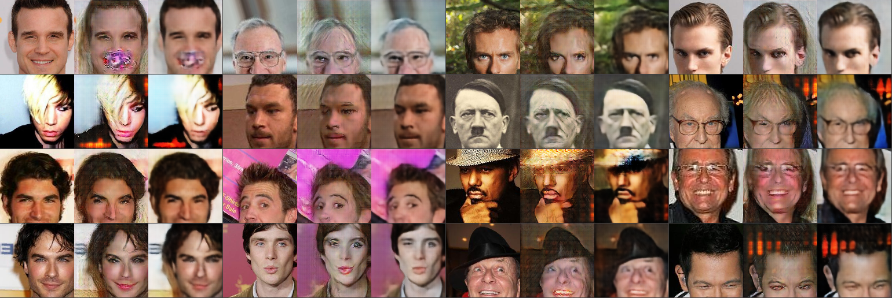

# NNabla-CycleGAN
A Chainer implementation of Wasserstein GAN.

# Requirements
- Python3
- numpy
- NNabla 0.9.3

# Usage
## download CelebA
You can download CelebA dataset with [this repository](https://github.com/dhgrs/download_dataset).

After downloading, substitute the directory for `root` in opt.py.

## CycleGAN with CelebA(with GPU #n)
```
python cyclegan.py -g n
```

## CycleGAN with CelebA(without GPU)
```
python cyclegan.py
```

# Result

